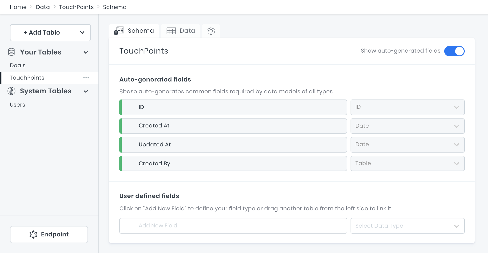
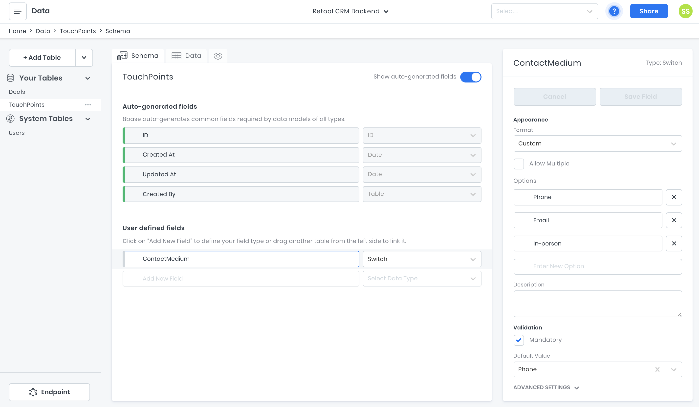
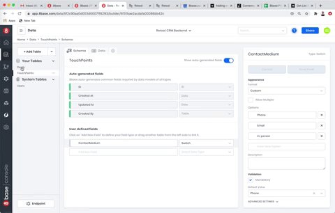
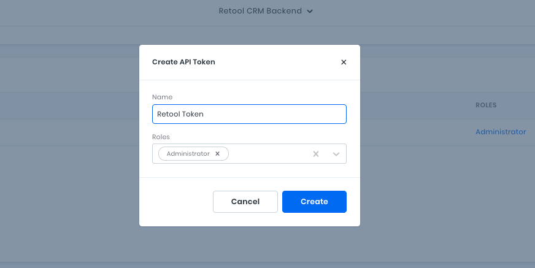
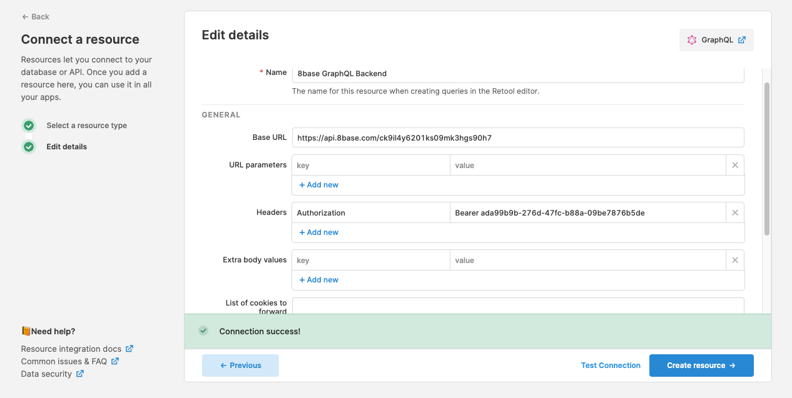
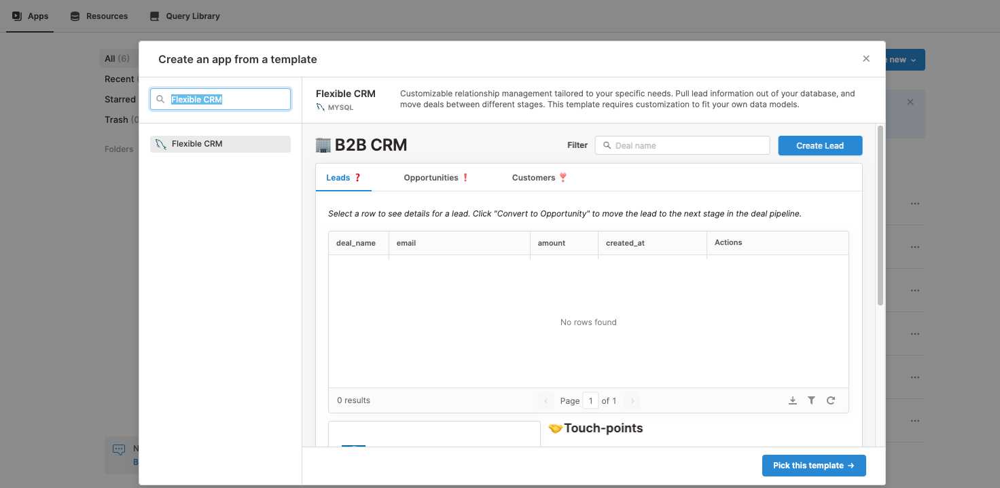
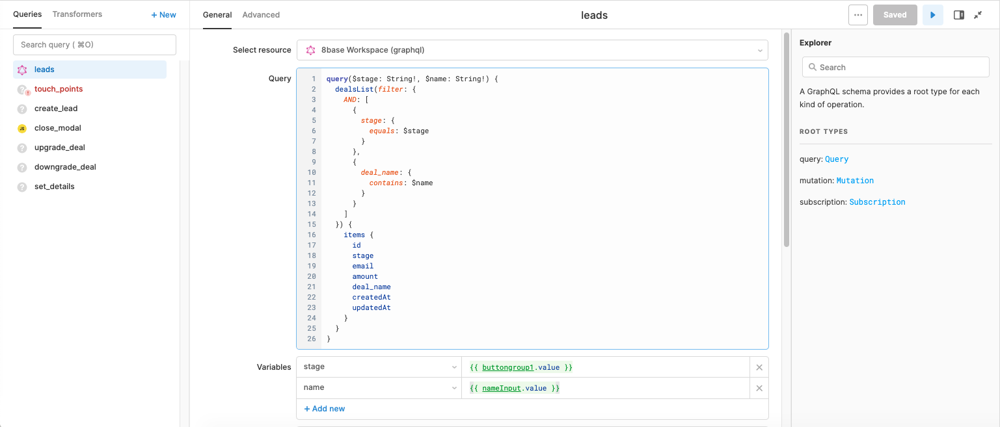
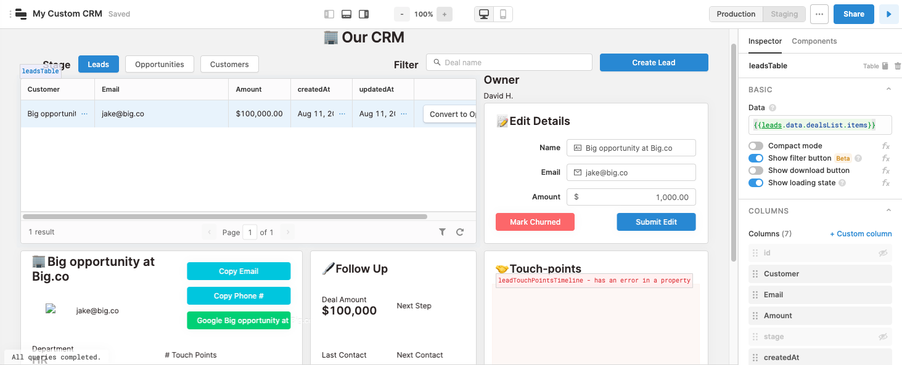
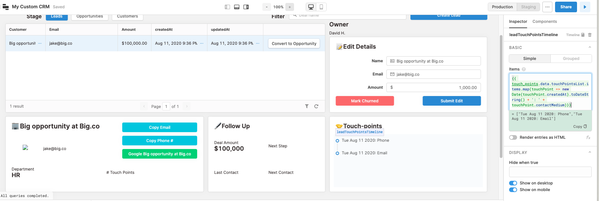

# Develop a Custom CRM using Retool and 8base

The proliferation of low-code and no-code technologies during the last several years has been profound. Across the globe, more and more people that don't possess traditional computer science backgrounds or coding experience are able to ideate and implement software projects. In many cases this happens without them writing a single line of code.

There are countless custom software tools that can get developed to best enable productivity within specific use-cases. Unfortunately, developing such tools rarely justifies the budget for hiring engineers to do "from scratch" builds or even top-shelf SaaS subscriptions.

It's in this realm that the low-code and no-code platforms provide so much value; for the "citizen developer" that often spearheads internal business app projects to drive efficiencies within their organizations.

## Building a Custom CRM using Low-code Platforms

In this tutorial we're going to look at how to build a custom CRM using 2 popular low-code development platforms; [Retool](https://retool.com) and [8base](8base). This will not only give you a great understanding of how Retool can connect to and work with a GraphQL API, but also demonstrate how quickly you can develop powerful business applications using little to no code!

To get started, you're going to need create an account on Retool and 8base. Both services offer free tiers and trials that will be 100% sufficient for completing this tutorials.

- [8base Sign-up](https://app.8base.com)
- [Retool Sign-up](https://login.retool.com/auth/login)

As the title of this article suggests, we're going to be building a custom CRM that lets a user move deals through a simple sales funnel. We'll take it step by step, so let's get going!

## Building a Custom CRM Data-model and GraphQL API

We're going to start by taking care of the backend of our app before moving into the frontend. This is because Retool has a great custom CRM template that we'll be able to retro-fit to our backend once it's set up.

There are a number of resources available for how to setup an 8base workspace. If you're unfamiliar, completing steps [1 and 2 of their Quick Start](https://docs.8base.com/docs/getting-started/quick-start/) will get you off to the races.

That said, we're going to start off the in [Data Builder](https://app.8base.com/data) of your workspace. It's here that we're going to be able to visually construct our application's data-model using no-code.

For this CRM tutorial, we're going to be adding two tables to our workspace; _Deals_ and _TouchPoints_. Go on ahead and create both of these two tables using the suggested names. By clicking the "+ Add Table" button, you'll be prompted to input the table name.



Once the tables are added, we're going to go ahead and start adding fields to them. Think of table fields like cells in a spreadsheet that are within a specific column. Every field needs a _name_ and a _type_ and can have some optional settings specified. Let's start with the _TouchPoints_ table since it's going to be pretty simple.

On the _TouchPoints_ table, add a field to its schema called "ContactMedium" and set they field type as a _Switch_. In the field settings, set the format to _Custom_ and then specify "Phone", "Email", and "In-person" as the options. These options specify the all possible values that this field will allow to be saved.

Lastly, check the _Mandatory_ checkbox and select "Phone" as the default value since we will always require this field on a _TouchPoint_. With all these changes, your _ContactMedium_ field and settings should look like the image below.



After that, we're going to have to build a relationship between the _Deals_ and _TouchPoints_ table. This is because many _TouchPoints_ can happen during the life of a _Deal_, and we're going to want a _has_many_ relationship to model that.

All you're going to need to do is drag the _Deals_ table over the _TouchPoints_ table's schema and drop it into the "Add New Field" input. This will wire up most of what's needed automatically. What you'll want to set manually are the following items.

1. Name the relationship "Deal" on the _TouchPoints_ schema.
2. Confirm that _Allow multiple TouchPoints per Deal_ is checked in the relationship settings and **not** _Allow multiple Deals per TouchPoint_.
3. Check the _Deal field is Mandatory_ validation.



Nice work so far! We're going to speed it up now since you've already learned how to create tables, add fields, and build relationships between tables.

Our _Deals_ table is going to be storing much more information. It's serving as the main record in our CRM. Click over into its schema and try to add the following fields with the right types and settings!

**Deals Table**

- **email** (type = Text, Field Size = 30, Mandatory = true)
- **stage** (type = Switch, Format = Custom, Options = lead/opportunity/customer, Mandatory = true, Default Value = lead)
- **amount** (type = Number, Decimal places = 2)
- **deal_name** (type = Text, Field Size = 100, Mandatory = true)
- **department** (type = Text, Field Size = 100)
- **phoneNumber** (type = Text, Field Size = 12)
- **TouchPoints** (type = Table)

At this point, our data model is set up and our API is actually ready to use! Just for fun, let's go ahead and add our first deal to the database using the GraphQL API.

Move over into the [workspace API Explorer](https://app.8base.com/api-explorer). This is a great environment for writing and testing your GraphQL queries, mutations, and subscriptions. However, you can always use another GraphQL client if you want, like GraphiQL or Postman. That said, if you set your tables up correctly, go ahead and run the following mutation to add a deal that already has 2 touch points.

```graphql
mutation {
  dealCreate(
    data: {
      deal_name: "Big opportunity at Big.co"
      department: "Marketing"
      email: "jake@big.co"
      amount: 100000.00
      stage: "lead"
      touchPoints: {
        create: [{ contactMedium: "Phone" }, { contactMedium: "Email" }]
      }
    }
  ) {
    id
    deal_name
    createdAt
  }
}
```

Since the API Explorer is embedded in the 8base console, it's able to handle authentication for you. That said, to allow our Retool frontend to talk to 8base, we're going to [generate an API Token](https://docs.8base.com/docs/8base-console/roles-and-permissions/#api-tokens) and assign it the necessary role.

Navigate to [Settings > API Tokens](https://app.8base.com/settings/api-tokens) and click the plus button. Name the token whatever you like, however make sure that you assign it the _Administrator_ role! This will allow the Retool full access to our workspace tables.

**Copy and paste the token value somewhere safe once you create it!** It's only visible once.



Awesome! Our backend for the application is set up. It's not time to go ahead and retrofit our frontend CRM template.

## Setting up Retool with a GraphQL Resource and Custom CRM template

Retool allows you to connect to a crazy number of data-sources - both APIs and databases. Since 8base exposes a GraphQL endpoint, we're first going to be adding a GraphQL Resource to our account.

Starting at the home screen of your Retool account, move to the _Resources_ tab and click on the _Create New_ button. You're going to then scroll down to the APIS section and select the _GraphQL_ option. Once open, it will prompt you for some information that we'll add from our 8base workspace.

**Name** - "8base GraphQL Backend"
**Base URL** - "YOUR_8BASE_WORKSPACE_ENDPOINT"
**Headers** - key = "Authorization", value = "Bearer YOUR_API_TOKEN"

The 8base workspace endpoint can be found in the _Settings_ page of your workspace as _Endpoint URL_. Go ahead and replace `YOUR_8BASE_WORKSPACE_ENDPOINT` with it, as well as `YOUR_API_TOKEN` with the token you generated earlier. Once set, you can test click _Test Connection_ to make sure everything works and the create the resource!



Now lets move back to the _Apps_ tab of your Retool account and create a new app. From the dropdown, select _Create from template_ and the search for "Flexible CRM". Pick the template with a MySQL database once it pops up! Name it something like "My Custom CRM" and create the app.



What you're likely seeing now is a CRM interface and a bunch of error messages. That's fine! The template expects there to be a direct connection to a MySQL database, though we're going to need to do some retro fitting in order to make it work with the GraphQL API that we set up. So to start, lets update our _Queries_.

### leads Query

The _leads_ query is going to fetch all our deals from the API, taking into consideration what _stage_ we're looking at as well as whether any filter has been typed in. So in the bottom left of the screen under _Queries_ click on _leads_. Set the resource as _8base GraphQL Backend_ and update the query input with the following code snippet.

```graphql
query($stage: String!, $name: String!) {
  dealsList(
    filter: {
      AND: [{ stage: { equals: $stage } }, { deal_name: { contains: $name } }]
    }
  ) {
    items {
      id
      stage
      email
      amount
      deal_name
      createdAt
      updatedAt
    }
  }
}
```

Since the arguments `$name` and `$stage` are specified in the query, Retool automatically generates variable inputs below the query so that we can specify their values. Additionally, almost every component in Retool is accessible from the global scope. This allows us to access data properties from other components. Therefore, we can access the current `stage` value by setting it to `{{ buttongroup1.value }}` and the name value from the search component's value, `{{ nameInput.value }}`.



Once our _leads_ query is updated we're going to want to make sure our table is accessing the response! Click on the table component and in the _Inspector_ on the right side of the screen update the **Data** input to `{{leads.data.dealsList.items}}`, which is the nested structure of our query response. Once updated, that first deal that we created should populate your table!



### touch_points Query

Lets now update our _touch_points_ query. Select the _8base GraphQL Backend_ resource and then paste in the following query.

```graphql
query($dealId: ID!) {
  touchPointsList(filter: { deal: { id: { equals: $dealId } } }) {
    items {
      id
      createdAt
      contactMedium
    }
  }
}
```

This query will fetch a list of _TouchPoints_ associated with a specific deal. That said, we need to pass it a deal ID... how do we get that?

The Retool table component has a cool feature which is that it makes available the data from currently selected row. We'll be accessing this value in a number of our components. However, in the _touch_points_ query it gets set as `{{ leadsTable.selectedRow.data.id }}` in the `dealId` value.

After saving the query, click over to the touch points component and once again lets update its settings. In the **Items** input, we're going to want to update the javascript function. Essentially, we want to create an array of text values that represent the touch points that have occurred.

If you're not familiar with javascript, don't worry about it. Go ahead and copy the following snippet into the **Items** input.

```js
{{ touch_points.data.touchPointsList.items.map(touchPoint => new Date(touchPoint.createdAt).toDateString() + ': ' + touchPoint.contactMedium }}
```



Nice work! At this point, I think you're getting the hang of Retool. So lets speed it up and breeze through the next four queries.

### create_lead Mutation

- Resource: 8base GraphQL Backend
- Query:

```graphql
mutation(
  $phoneNumber: String!
  $department: String!
  $deal_name: String!
  $email: String!
  $amount: Float!
) {
  dealCreate(
    data: {
      phoneNumber: $phoneNumber
      department: $department
      deal_name: $deal_name
      amount: $amount
      email: $email
      stage: "lead"
    }
  ) {
    id
  }
}
```

- Variables:
  - amount = `{{ parseInt(newDealAmount.value) }}`
  - department = `{{ newDealDepartment.value }}`
  - phoneNumber = `{{ newDealPhone.value }}`
  - deal_name = `{{ newDealName.value }}`
  - email = `{{ newDealEmail.value }}`

### upgrade_deal Mutation

- Resource: 8base GraphQL Backend
- Query:

```graphql
mutation($stage: String!, $id: ID!) {
  dealUpdate(data: { id: $id, stage: $stage }) {
    id
    stage
    email
    amount
    deal_name
  }
}
```

- Variables:

  - stage = `{{ leadsTable.selectedRow.data.stage === 'lead' ? 'opportunity' : 'customer'}}`
  - id = `{{ leadsTable.selectedRow.data.id }}`

- After this Query Runs:
  - Remove "opportunities"

### downgrade_deal Mutation

- Resource: 8base GraphQL Backend
- Query:

```graphql
mutation($stage: String!, $id: ID!) {
  dealUpdate(data: { id: $id, stage: $stage }) {
    id
    stage
    email
    amount
    deal_name
  }
}
```

- Variables:

  - stage = `{{ leadsTable.selectedRow.data.stage === 'opportunity' ? 'lead' : 'opportunity'}}`
  - id = `{{ leadsTable.selectedRow.data.id }}`

- After this Query Runs:
  - Remove "opportunities"

### set_details Query

- Resource: 8base GraphQL Backend
- Query:

```graphql
mutation($email: String, $name: String, $amount: Float, $id: ID!) {
  dealUpdate(
    data: { id: $id, email: $email, amount: $amount, deal_name: $name }
  ) {
    id
    email
    amount
    deal_name
  }
}
```

- Variables:

  - id = `{{ leadsTable.selectedRow.data.id }}`
  - amount = `{{ textinput6.value }}`
  - email = `{{ textinput7.value }}`
  - name = `{{ textinput8.value }}`

- After this Query Runs:
  - Remove "opportunities"

## Updating the Custom CRM components

If you're still here, you're a trooper! We getting close to the finish line, so hang in there!

After updating all of our GraphQL queries, we also need to update our Retool components so that they are reading from the correct data values. So lets run through them one by one and knock it out.

### Image component

The _image1_ component dynamically generates a random image when given a seed value. Go ahead and update its **Image URL** value to be `https://picsum.photos/id/{{ leadsTable.selectedRow.data.amount % 500 }}/200/200`.

### Touch Points count

The _text13_ component counts how many touch points have been made. We can easily display this by updating its **Value** to:

```text
\# Touch Points

#### {{touch_points.data.touchPointsList.items.length}}
```

### Last contact date

For the _text14_ component, we're showing the date of the last touch point. This gets accessed from our touch points data and formatted using _MomentJS_.

```text
Last Contact

#### {{ moment(touch_points.data.touchPointsList.items[0].createdAt).format('MM/DD/YY')}}
```

### Next Step and Next Contact

These next two components (_text15_, _text16_) simply suggest the next step by suggesting a different contact medium than was used for the last touch point be made a week after.

```text
Next Step

#### {{ touch_points.data.touchPointsList.items[0].contactMedium === 'email' ? 'Phone Call' : touch_points.data.touchPointsList.items[0].contactMedium === 'phone' ? 'Book Meeting': 'Send Email' }}
```

```text
Next Contact

#### {{ moment(touch_points.data.touchPointsList.items[0].createdAt).add(moment.duration(1, 'week')).format('MM/DD/YY')}}
```

## Testing the Custom CRM


You did it! Go ahead and press the play button in the top left of the editor. You can now start creating, editing, and performing other operations on your deals.

Most importantly though, you can also start customizing your CRM to be whatever you want it to be. The skills you learned in this tutorial are the basics for building business apps using Retool and 8base, both of which have tons more useful features to help you conquer worthwhile projects!

I hope you found this tutorial helpful! Feel free to reach out with questions and comments.
